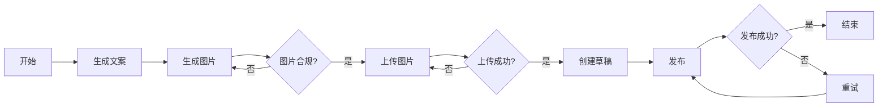
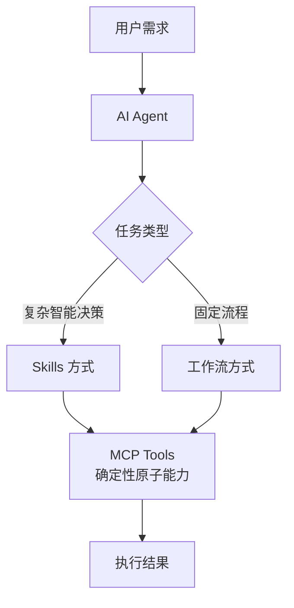

# Skills 方式 vs 传统工作流：对比分析

## 概述

本文档对比分析基于 AI Agent + MCP 的 **Skills 方式**与传统工作流工具（n8n、make、coze）在实现复杂任务时的差异。

## 核心区别

### 传统工作流（n8n/make/coze）

**特点：**

- ✅ **确定性执行**：预定义的节点顺序，固定的执行路径
- ✅ **可视化编排**：拖拽式界面，清晰的流程图
- ✅ **审计友好**：每一步都可追溯和验证
- ❌ **灵活性有限**：需要预先设计所有分支和异常处理
- ❌ **智能决策弱**：主要依赖条件判断，缺乏上下文理解
- ❌ **维护成本高**：复杂场景需要大量节点和连线

**适用场景：**

- 固定流程的批量处理
- 需要严格审计合规的场景
- 团队协作的可视化流程
- 简单的事件驱动任务

### Skills 方式（AI Agent + MCP）

**特点：**

- ✅ **智能决策**：AI 根据上下文动态选择技能组合
- ✅ **自适应执行**：遇到错误可以自动调整策略
- ✅ **自然语言驱动**：通过描述目标而非编排步骤
- ✅ **开发效率高**：无需设计复杂流程图
- ⚠️ **非确定性**：执行路径可能因上下文而异
- ⚠️ **黑盒风险**：AI 决策过程不完全透明

**适用场景：**

- 复杂的、需要智能决策的任务
- 需要频繁调整策略的场景
- 快速原型开发
- 个人或小团队的敏捷工作

## 执行方式对比

### 示例：发布小红书内容

#### 传统工作流方式



**特点：**

- 需要预先设计所有分支
- 每个异常情况都要手动配置
- 流程图可能非常复杂

#### Skills 方式

**用户输入：**

```
发布一篇关于咖啡的小红书笔记，需要3张图片
```

**AI Agent 自动执行：**

```markdown
1. 理解需求：分析任务 → 需要内容生成 + 图片 + 发布
2. 调用 skill: generate_content(topic="咖啡")
3. 调用 skill: generate_images(prompt="咖啡场景", count=3)
4. 调用 MCP: uploadImages(images)
   - 如果失败 → 自动压缩后重试
5. 调用 MCP: createNote(content, imageIds)
   - 如果审核失败 → 自动修改敏感词后重试
6. 调用 MCP: publishNote(noteId)
7. 返回结果
```

**特点：**

- AI 自动处理异常
- 无需预设所有分支
- 可根据实际情况调整策略

## 对比表

| 维度         | 传统工作流               | Skills 方式            |
| ------------ | ------------------------ | ---------------------- |
| **执行方式** | 预定义节点顺序           | AI 动态编排            |
| **开发方式** | 可视化拖拽               | 自然语言描述           |
| **适用场景** | 固定流程、批量处理       | 复杂决策、灵活场景     |
| **开发成本** | 高（需设计所有分支）     | 低（描述目标即可）     |
| **维护成本** | 高（流程变更需重新设计） | 低（调整提示词）       |
| **可控性**   | 强（完全可预测）         | 中（可审计但有随机性） |
| **智能程度** | 低（规则驱动）           | 高（上下文理解）       |
| **异常处理** | 手动预设                 | AI 自适应              |
| **学习曲线** | 中等（需学习工具）       | 低（自然语言）         |
| **团队协作** | 强（可视化流程）         | 弱（依赖提示词）       |

## 最佳实践

### 结合使用



**建议：**

1. **原子能力层**：使用 MCP 提供确定性的基础工具
2. **编排层**：
   - 简单固定流程 → 使用传统工作流
   - 复杂智能任务 → 使用 AI Agent + Skills
3. **混合使用**：在工作流中调用 AI Agent 处理复杂决策节点

## 结论

Skills 方式**完全可以**完成传统工作流的任务，且在以下场景更有优势：

- ✅ 需要智能决策
- ✅ 频繁变化的业务逻辑
- ✅ 快速原型验证
- ✅ 个人效率工具

传统工作流仍然适用于：

- ✅ 需要严格审计
- ✅ 团队协作可视化
- ✅ 完全确定性的流程
- ✅ 合规性要求高的场景

**推荐方案**：将 MCP 作为统一的能力提供层，上层根据场景选择 AI Agent 或传统工作流进行编排。
