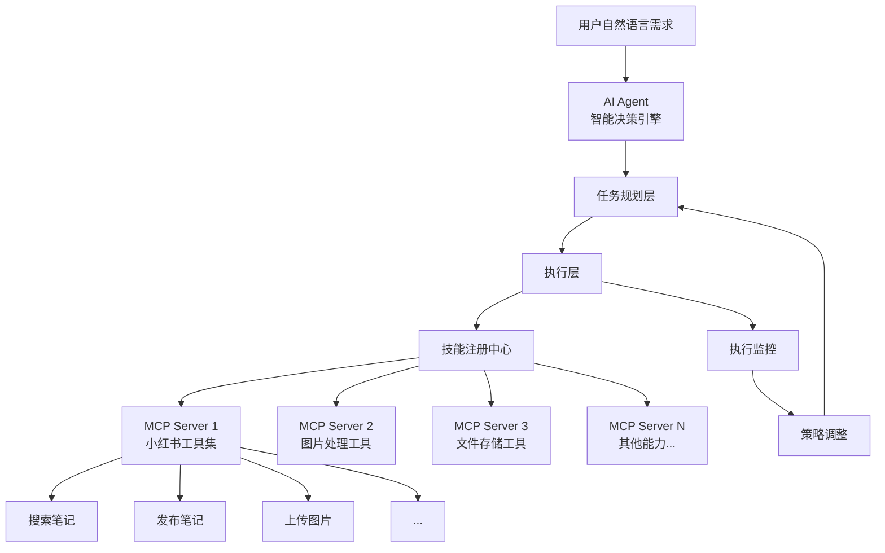
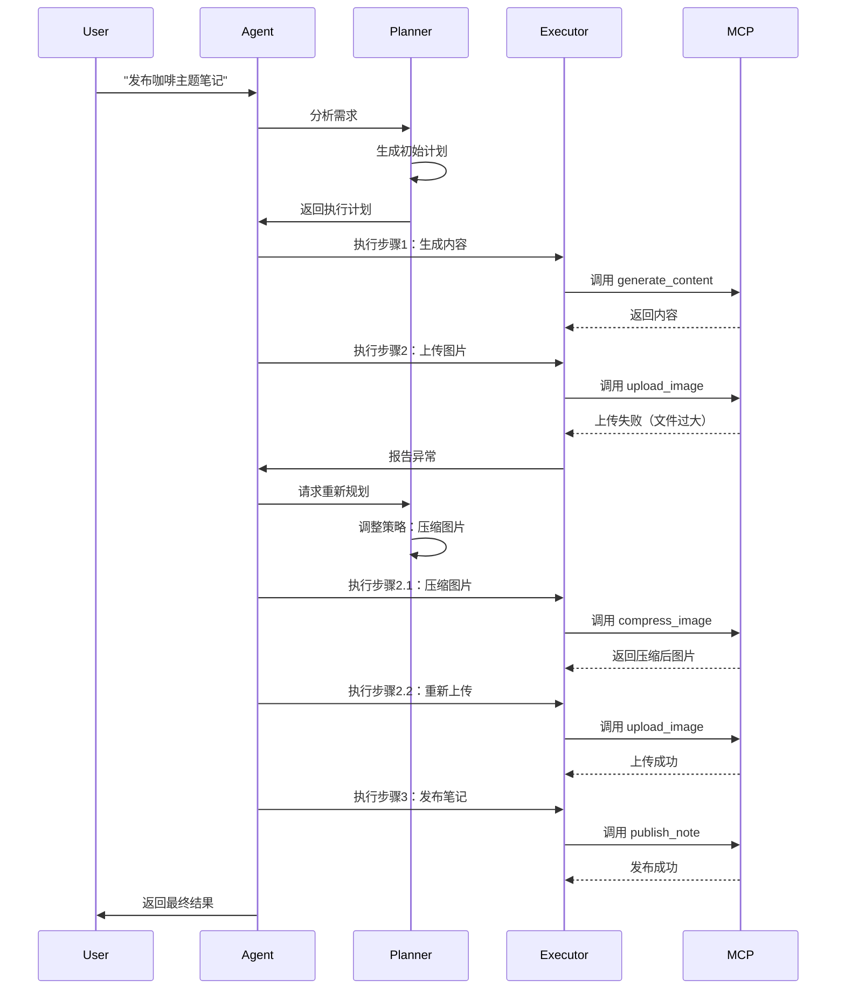

# Skills 技术实现原理

## 架构概览

Skills 方式基于 **AI Agent + MCP (Model Context Protocol)** 架构，实现智能化的任务编排。



## 核心组件

### 1. AI Agent（智能决策引擎）

**职责：**

- 理解用户自然语言需求
- 将复杂任务分解为子任务
- 选择合适的技能（MCP Tools）
- 根据执行结果动态调整策略

**工作流程：**

```python
# AI Agent 的内部推理逻辑（伪代码）
async def execute_task(user_goal: str):
    # 1. 理解和规划
    plan = await analyze_goal(user_goal)
    context = initialize_context()

    # 2. 动态执行
    for step in plan.steps:
        # 选择合适的技能
        skill = await select_skill(step, context)

        # 执行技能
        result = await skill.execute()
        context.update(result)

        # 智能异常处理
        if result.failed:
            # AI 自主决策：重试、调整参数或改变策略
            plan = await replan(plan, result, context)

    return context.final_result
```

### 2. MCP (Model Context Protocol)

**定义：**
MCP 是一个开放协议，用于标准化 AI 应用与外部工具/数据源的集成。

**核心概念：**

```json
{
  "server": "小红书 MCP Server",
  "tools": [
    {
      "name": "xhs_search_notes",
      "description": "搜索小红书笔记",
      "inputSchema": {
        "type": "object",
        "properties": {
          "keyword": { "type": "string" },
          "sort": { "type": "string", "enum": ["general", "popular"] }
        }
      }
    },
    {
      "name": "xhs_publish_note",
      "description": "发布小红书笔记",
      "inputSchema": {
        "type": "object",
        "properties": {
          "title": { "type": "string" },
          "content": { "type": "string" },
          "imageIds": { "type": "array" }
        }
      }
    }
  ]
}
```

**特点：**

- ✅ **确定性执行**：每个 MCP Tool 都是明确的函数调用
- ✅ **标准化接口**：统一的输入输出格式
- ✅ **可组合性**：工具可以自由组合编排
- ✅ **跨平台**：支持多种编程语言和框架

### 3. 技能注册中心

**功能：**

- 管理所有可用的 MCP Tools
- 提供技能发现和查询
- 处理技能版本和依赖

**示例结构：**

```javascript
{
  "skills": {
    "xhs_search_notes": {
      "server": "qingcloud-mcp",
      "version": "1.0.0",
      "tags": ["xiaohongshu", "search", "social-media"]
    },
    "xhs_upload_image": {
      "server": "qingcloud-mcp",
      "version": "1.0.0",
      "tags": ["xiaohongshu", "image", "upload"]
    }
  }
}
```

## 执行机制

### 智能决策流程



### 确定性 vs 智能性

**MCP Tool 层（确定性）：**

```java
// 每个 MCP Tool 都是确定性的函数
@MCPTool(name = "xhs_upload_image")
public UploadImageResult uploadImage(
    @Param("imageData") byte[] imageData,
    @Param("fileName") String fileName
) {
    // 确定的上传逻辑
    return xhsApiClient.uploadImage(imageData, fileName);
}
```

**AI Agent 层（智能性）：**

```
用户：上传这张图片
AI 推理：
  1. 检查图片大小 → 发现超过5MB
  2. 决策：先压缩再上传
  3. 调用 compress_image(image, targetSize=4MB)
  4. 调用 upload_image(compressed_image)
  5. 返回结果
```

## 技术栈

### 客户端（AI Agent）

- **Claude Desktop** + MCP 协议
- **OpenAI GPT** + Function Calling
- **自定义 Agent 框架**

### 服务端（MCP Server）

- **Node.js** + `@modelcontextprotocol/sdk`
- **Python** + `mcp` 库
- **Java** + 本项目 qingcloud-mcp

### 通信协议

- **标准 MCP 协议**（基于 JSON-RPC）
- **HTTP/SSE** 或 **Stdio** 传输

## 安全与可控性

### 执行监控

```javascript
// 每个工具调用都可以被监控和审计
{
  "timestamp": "2026-01-05T15:00:00Z",
  "tool": "xhs_publish_note",
  "input": {
    "title": "咖啡品鉴指南",
    "content": "..."
  },
  "output": {
    "noteId": "12345",
    "status": "success"
  },
  "execution_time": "1.2s"
}
```

### 权限控制

```yaml
# MCP 服务器可以配置权限
permissions:
  xhs_search_notes: allow
  xhs_publish_note: require_approval
  xhs_delete_note: deny
```

### 人工介入点

```python
# 关键操作可以要求人工确认
async def publish_note(content):
    if requires_approval(content):
        approval = await request_human_approval(content)
        if not approval:
            return "用户拒绝发布"

    return await mcp_tool.xhs_publish_note(content)
```

## 扩展性

### 添加新技能

```bash
# 1. 开发新的 MCP Tool
@MCPTool(name = "xhs_analyze_trends")
public TrendAnalysis analyzeTrends() { ... }

# 2. 重启 MCP Server
# 3. AI Agent 自动发现新技能
```

### 跨平台能力组合

```
AI Agent 可以同时调用：
- qingcloud-mcp（小红书）
- douyin-mcp（抖音）
- filesystem-mcp（文件系统）
- database-mcp（数据库）

实现跨平台的复杂任务编排
```

## 下一步

查看 [实践示例文档](./03-practical-examples.md) 了解具体应用场景。
