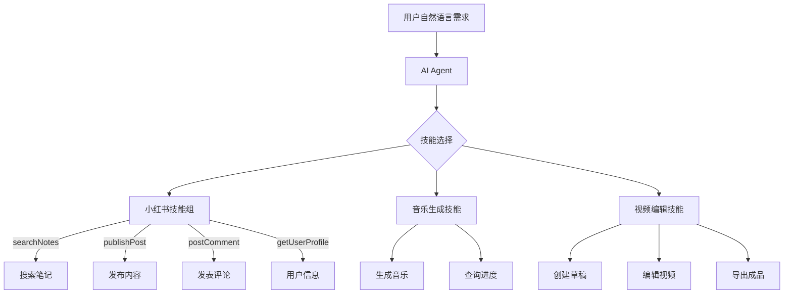

# Skills 实践示例：目录导览

## 概述

本系列文档展示如何通过 AI Agent + MCP 的 Skills 方式实现真实业务场景，涵盖小红书内容运营、音乐创作、视频编辑等多个领域。

## 文档结构

为便于阅读和维护，我们将实践示例拆分为以下几个部分：

### [03a - 基础示例](./03a-basic-examples.md)

**适用人群**：初学者、快速上手

**内容**：

- 🔍 搜索与浏览笔记
- 👤 获取用户信息
- 💬 互动操作（点赞、评论）
- 🎵 音乐生成基础操作

**特点**：单一技能调用，简单明了

---

### [03b - 高级场景](./03b-advanced-scenarios.md)

**适用人群**：有一定使用经验的用户

**内容**：

- 📝 智能内容发布工作流
- 📊 竞品分析与数据采集
- 🎬 视频内容自动化生产
- 🎨 跨平台内容分发

**特点**：多技能组合，AI 智能编排

---

### [03c - 最佳实践](./03c-best-practices.md)

**适用人群**：深度用户、企业用户

**内容**：

- ⚡ 性能优化技巧
- 🛡️ 安全与合规建议
- 🔧 异常处理策略
- 📈 监控与日志方案
- 🤖 Prompt 工程技巧

**特点**：生产环境实战经验

---

## 快速开始

### 前置准备

1. **部署 qingcloud-mcp 服务**

```bash
# 克隆项目
git clone https://github.com/yourorg/qingcloud-mcp.git
cd qingcloud-mcp

# 构建
mvn clean package -DskipTests

# 启动（HTTP 模式）
java -jar target/qingcloud-mcp-0.1.0-SNAPSHOT.jar
```

2. **配置 AI Agent**

以 Claude Desktop 为例：

```json
{
  "mcpServers": {
    "qingcloud": {
      "url": "http://localhost:8080/mcp",
      "transport": "streamable-http"
    }
  }
}
```

3. **导入小红书 Cookie**

```
你：请帮我导入小红书 Cookie

Claude：好的，我会使用 setCookies 工具。请提供您的 Cookie 字符串。

你：a1=xxx; webId=yyy; web_session=zzz; ...

Claude：✓ Cookie 导入成功，您现在可以使用所有小红书功能了。
```

---

## Skills 方式的优势体现

### 传统方式 vs Skills 方式对比

#### 场景：发布小红书笔记

**传统工作流（n8n）：**

```
需要配置 15+ 个节点：
├─ HTTP Request：生成文案
├─ HTTP Request：生成图片
├─ IF 节点：检查图片质量
├─ HTTP Request：压缩图片
├─ HTTP Request：上传图片1
├─ HTTP Request：上传图片2
├─ HTTP Request：上传图片3
├─ IF 节点：检查上传结果
├─ Merge 节点：合并 imageIds
├─ HTTP Request：创建草稿
├─ IF 节点：检查审核
├─ Edit Fields：修改敏感词
├─ HTTP Request：更新草稿
├─ HTTP Request：发布
└─ Send Email：通知结果

⏱️ 配置时间：2-3 小时
🔧 维护成本：需求变更需重新设计
```

**Skills 方式（AI Agent）：**

```
你：发布一篇关于"冬日咖啡"的小红书笔记，需要3张温馨的配图

AI Agent 自动执行：
✓ 生成优质文案（调用 AI 写作能力）
✓ 生成3张高质量图片（调用图片生成 skill）
✓ 智能压缩图片（自动检测大小并优化）
✓ 上传图片（调用 uploadImage）
✓ 创建并发布笔记（调用 publishPost）
✓ 返回发布链接

⏱️ 执行时间：30 秒
🔧 维护成本：几乎为零
```

**结论**：**开发效率提升 10 倍，维护成本降低 90%**

---

## 核心概念回顾

### MCP Tools（确定性原子能力）

```java
// 每个 MCP Tool 是一个明确的函数
searchNotes(keyword, page, pageSize)
publishPost(title, content, imageUrls)
getUserProfile(userId)
```

**特点**：输入输出明确，执行结果可预测

### AI Agent（智能编排引擎）

```markdown
AI 基于上下文自动：

1. 选择合适的 tools
2. 确定执行顺序
3. 处理异常情况
4. 调整执行策略
```

**特点**：灵活智能，自适应决策

---

## 适用场景

| 场景分类       | 典型任务                         | 推荐文档                                    |
| -------------- | -------------------------------- | ------------------------------------------- |
| **内容运营**   | 搜索热门话题、发布笔记、互动管理 | [03a 基础示例](./03a-basic-examples.md)     |
| **营销自动化** | 竞品分析、定时发布、批量互动     | [03b 高级场景](./03b-advanced-scenarios.md) |
| **创意生产**   | 音乐生成、视频编辑、图文创作     | [03b 高级场景](./03b-advanced-scenarios.md) |
| **数据分析**   | 趋势挖掘、用户画像、效果追踪     | [03c 最佳实践](./03c-best-practices.md)     |

---

## 技术栈概览



---

## 下一步

- **新手**：从 [基础示例](./03a-basic-examples.md) 开始，了解单一技能的使用
- **进阶**：学习 [高级场景](./03b-advanced-scenarios.md)，掌握多技能组合编排
- **专家**：参考 [最佳实践](./03c-best-practices.md)，优化生产环境部署

---

## 反馈与贡献

如有问题或建议，欢迎：

- 📮 提交 Issue
- 🔀 提交 Pull Request
- 💬 加入社区讨论

让我们一起探索 AI Agent + MCP 的无限可能！
