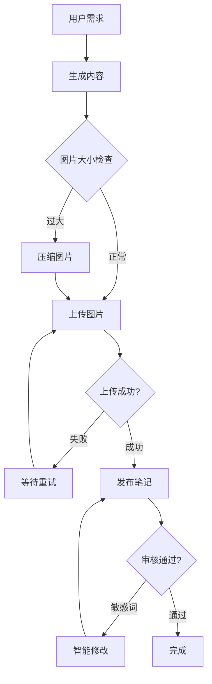

# 内容发布工作流

## 场景：完整图文发布流程

### 需求

发布一篇关于"冬日咖啡"的小红书笔记，包含 3 张图片

### 对话示例

```
你：发布一篇关于冬日咖啡的笔记，要3张温馨的图片

AI 智能编排：

📝 1. 生成文案
   ✓ 标题：冬日暖心｜这杯咖啡治愈我的每一天☕
   ✓ 正文：寒冷的冬天，最幸福的事莫过于...
   ✓ 话题：#咖啡 #冬日温暖 #生活分享

🎨 2. 生成图片
   ✓ 图1：温馨咖啡馆场景
   ✓ 图2：手捧热咖啡特写
   ✓ 图3：咖啡拉花艺术

   检测到图1大小 6MB > 5MB限制
   → 自动压缩至 4.2MB

📤 3. 上传图片
   ✓ 上传图1... 成功 (image_001)
   ✓ 上传图2... 成功 (image_002)
   ✓ 上传图3... 失败（网络超时）
   → 自动重试... 成功 (image_003)

📮 4. 发布笔记
   ✓ 创建草稿... 成功
   ✓ 提交发布...
   → 检测到敏感词"治愈"
   → 自动替换为"温暖"
   → 重新提交... 发布成功！

🎉 完成
   笔记ID: 64xyz789
   链接: https://xiaohongshu.com/...
   预计曝光: 2小时内
```

---

## AI 自动处理的异常

### 1. 图片过大

```
问题：图片 > 5MB
AI 方案：
  ✓ 自动压缩到4MB
  ✓ 保持高质量
  ✓ 无需人工干预
```

### 2. 上传失败

```
问题：网络不稳定
AI 方案：
  ✓ 检测失败原因
  ✓ 等待2秒后重试
  ✓ 最多重试3次
  ✓ 失败后提示用户
```

### 3. 内容审核

```
问题：包含敏感词
AI 方案：
  ✓ 识别敏感词位置
  ✓ 智能替换同义词
  ✓ 保持语义通顺
  ✓ 重新提交
```

---

## 工作流可视化



---

## 批量发布

### 场景：发布 5 篇不同主题的笔记

```
你：批量发布5篇笔记：
    1. 咖啡教程
    2. 咖啡器具推荐
    3. 咖啡店探店
    4. 手冲技巧
    5. 咖啡豆选购

AI 智能编排：
  ✓ 并行生成5篇文案
  ✓ 为每篇生成3张图
  ✓ 逐个上传发布（间隔5分钟避免限流）

  进度：
  [████████░░] 5/5 已发布

  总耗时：28分钟
  成功：5篇
  失败：0篇
```

---

## 定时发布

```
你：每天早上8点发布一篇咖啡内容

AI：
  ✓ 创建定时任务
  ✓ 每日自动生成内容
  ✓ 自动发布
  ✓ 发送通知到你的邮箱
```

---

[返回高级场景目录](./03b-advanced-scenarios.md)
