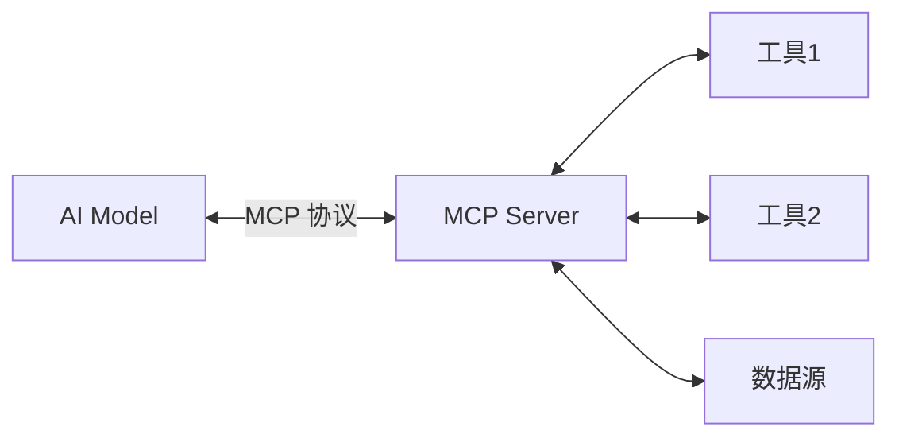

# MCP 协议概述

## 什么是 MCP？

**MCP (Model Context Protocol)** 是 Anthropic 开发的开放协议，用于连接 AI 模型与外部工具和数据源。



---

## MCP vs Claude API Skills

### Claude API Skills（托管方式）

```
你的应用 → Claude API → Claude 执行 Skills
```

**特点：**

- ✅ 托管在 Claude 平台
- ✅ 无需自建基础设施
- ❌ 需要 API 密钥和网络
- ❌ 按使用量计费

### 自建 MCP Server（自主方式）

```
你的应用 → 你的 MCP Server → 本地执行工具
```

**特点：**

- ✅ 完全本地化
- ✅ 数据不出本地
- ✅ 免费使用
- ❌ 需要自己实现

---

## MCP 核心概念

### 1. MCP Server

提供工具能力的服务端：

```java
// 示例：qingcloud-mcp 项目
public class QingcloudMCPServer {
    // 提供小红书相关工具
    - searchNotes()
    - publishPost()
    - getUserProfile()
    // ...
}
```

### 2. MCP Client

调用工具的客户端：

```python
# 你的应用
mcp_client = MCPClient("http://localhost:8080/mcp")

# 调用工具
result = mcp_client.call_tool(
    name="searchNotes",
    arguments={"keyword": "咖啡"}
)
```

### 3. Tools（工具）

具体的功能实现：

```json
{
  "name": "searchNotes",
  "description": "搜索小红书笔记",
  "inputSchema": {
    "type": "object",
    "properties": {
      "keyword": { "type": "string" }
    }
  }
}
```

---

## 适用场景

### ✅ 选择 MCP Server 如果：

- 需要完全私有化部署
- 数据敏感，不能传到外部
- 有自己的 AI 模型
- 需要完全控制执行环境
- 预算有限，希望长期免费使用

### ❌ 不适合的情况：

- 只是简单使用，不想维护服务器
- 需要 Claude 的智能能力
- 团队没有技术实力维护

---

## MCP 协议基础

### 请求格式

```json
{
  "jsonrpc": "2.0",
  "method": "tools/call",
  "params": {
    "name": "searchNotes",
    "arguments": {
      "keyword": "咖啡"
    }
  },
  "id": 1
}
```

### 响应格式

```json
{
  "jsonrpc": "2.0",
  "result": {
    "content": [
      {
        "type": "text",
        "text": "{\"items\": [...], \"total\": 20}"
      }
    ]
  },
  "id": 1
}
```

---

## 已有的 MCP Server 实现

### qingcloud-mcp（本项目）

功能：小红书、音乐生成、视频编辑

```bash
# 启动
java -jar qingcloud-mcp.jar

# 使用
curl http://localhost:8080/mcp \
  -d '{"method":"tools/list"}'
```

### 其他开源实现

- **filesystem-mcp** - 文件系统操作
- **database-mcp** - 数据库查询
- **web-search-mcp** - 网页搜索

---

## 与 AI 模型集成

### 使用 Claude

```python
import anthropic

client = anthropic.Anthropic()

# 虽然 Skills 托管在 Claude，
# 但你可以参考 MCP 思路实现本地工具
```

### 使用其他 LLM

```python
from openai import OpenAI

# 自己实现工具调用逻辑
client = OpenAI()

tools = get_mcp_tools()  # 从你的 MCP Server 获取

response = client.chat.completions.create(
    model="gpt-4",
    messages=[...],
    tools=tools
)
```

---

## 下一步

- **实现 MCP Server** → [MCP 实现指南](./04g-mcp-implementation.md)
- **项目集成** → [MCP 集成](./04h-mcp-integration.md)
- **参考实现** → `qingcloud-mcp` 项目代码

---

[返回主目录](./04-skills-integration-guide.md)
