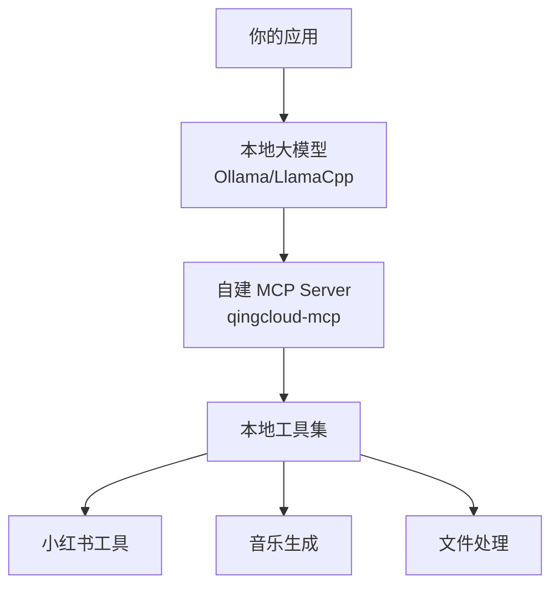

# 完全本地化 Skills 方案

## 概述

**可以！** 你完全可以不使用远程大模型，实现完全本地化的 Skills 系统。

## 核心架构



**关键点：**

- ✅ **本地大模型**：使用 Ollama、LlamaCpp 等运行本地 LLM
- ✅ **自建 MCP Server**：qingcloud-mcp 项目已实现
- ✅ **工具本地化**：所有工具在本地执行
- ✅ **数据不出本地**：完全私有化

---

## 方案对比

| 方案           | 大模型            | Skills 执行  | 数据流向         | 成本     |
| -------------- | ----------------- | ------------ | ---------------- | -------- |
| Claude API     | Claude (云端)     | Claude 沙箱  | 传输到 Anthropic | 按量计费 |
| **本地化方案** | **Ollama (本地)** | **本地 MCP** | **完全本地**     | **免费** |

---

## 文档导航

本系列拆分为多个小文档：

### 1. [05a-local-llm-setup.md](./05a-local-llm-setup.md)

- 本地大模型选择
- Ollama 安装配置
- 模型下载和测试

### 2. [05b-local-function-calling.md](./05b-local-function-calling.md)

- Function Calling 实现
- 工具调用格式
- Prompt 工程

### 3. [05c-llm-mcp-integration.md](./05c-llm-mcp-integration.md)

- 本地 LLM 与 MCP 集成
- 完整代码示例
- 工作流程

### 4. [05d-local-deployment.md](./05d-local-deployment.md)

- 部署架构
- 性能优化
- 最佳实践

---

## 快速预览

### 技术栈

```yaml
大模型: Ollama (qwen2.5, llama3.1)
Skills: qingcloud-mcp (自建)
语言: Python / Java
部署: Docker / 裸机
```

### 最简示例

```python
from ollama import chat
from mcp_client import MCPClient

# 1. 初始化本地 LLM
llm = chat

# 2. 初始化 MCP 客户端
mcp = MCPClient("http://localhost:8080/mcp")

# 3. 获取可用工具
tools = mcp.list_tools()

# 4. 调用本地 LLM
response = llm(
    model='qwen2.5',
    messages=[{'role': 'user', 'content': '搜索咖啡笔记'}],
    tools=tools
)

# 5. 执行工具调用
if response.tool_calls:
    result = mcp.call_tool(
        response.tool_calls[0].name,
        response.tool_calls[0].arguments
    )
```

---

## 优势

- ✅ **完全免费**：无 API 调用费用
- ✅ **数据安全**：数据不离开本地网络
- ✅ **可定制**：可以微调模型
- ✅ **无限制**：不受 API 频率限制
- ✅ **离线运行**：不需要网络连接

## 挑战

- ⚠️ **需要硬件**：GPU 推荐（16GB+ VRAM）
- ⚠️ **模型能力**：本地模型可能不如 Claude
- ⚠️ **维护成本**：需要自己管理模型和服务

---

## 下一步

- **安装本地模型** → [Ollama 安装指南](./05a-local-llm-setup.md)
- **实现 Function Calling** → [函数调用实现](./05b-local-function-calling.md)
- **完整集成** → [LLM-MCP 集成](./05c-llm-mcp-integration.md)

---

[返回 Skills 集成主目录](./04-skills-integration-guide.md)
